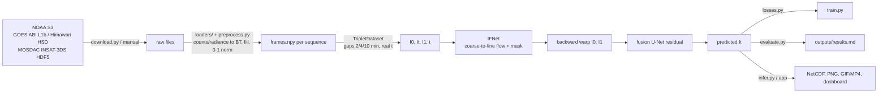

# SatFIN — Satellite Frame Interpolation Network

RIFE-style optical-flow frame interpolation to raise the temporal resolution of
geostationary satellite imagery. Trains on 1-min GOES mesoscale data, runs
inference on low-cadence data at any cadence. Readers exist for GOES ABI (NetCDF), Himawari AHI (HSD) and
INSAT-3D/3DR/3DS imager (HDF5).



Pipeline: download → preprocess → train → evaluate → infer / dashboard.
Quick demo of the whole pipeline on the small sample (small download, 500 training steps):
`bash scripts/quick_demo.sh` or `powershell -File scripts/quick_demo.ps1`.
Set `STEPS=20 N=8` for a smoke test that takes about 2 minutes.

## Setup

Requires Python 3.10+.

```bash
python -m venv .venv
# Windows: .venv\Scripts\activate    Linux/macOS: source .venv/bin/activate
pip install -r requirements.txt
# NVIDIA GPU: replace the CPU wheel with a CUDA build, e.g.
pip install --upgrade torch --index-url https://download.pytorch.org/whl/cu130
python -m satfin.env_check            # prints Python/PyTorch/GPU info
```

`env_check` must print your GPU. If it says "none found" on a machine with an NVIDIA card, the CPU wheel is installed.
Without a GPU, everything falls back to CPU with tiny settings (the `cpu:` section of the config).

## Data download

GOES ABI L1b radiances come from the public NOAA buckets (`noaa-goes16/18/19`, anonymous).
Mesoscale sectors (`M1`, `M2`) run at ~1-min cadence and give real ground truth.

```bash
python -m satfin.data.download --satellite goes19 --band 13 --start 2025-06-01T18:00 --hours 3 --sector M1
# or: bash scripts/download_goes.sh
```

Files land in `data/raw/<satellite>/<sector>/C<band>/`; existing files are skipped.
`--sector F|C` also works (full disk / CONUS, 10/5-min cadence). Defaults live in `configs/default.yaml`.
Mesoscale sectors can be moved between events, so check the sector center when picking dates.

Himawari-9 (`noaa-himawari9`, HSD `.DAT.bz2`) uses the same CLI. The `Target` sector is a 500×500 area scanned
every 2.5 min, so it has real ground truth. `FLDK` is the full disk, 10 segments per 10-min scan.

```bash
python -m satfin.data.download --satellite himawari9 --sector Target --band 13 --start 2025-06-01T03:00 --hours 2
```

INSAT-3DS needs a free MOSDAC account (https://mosdac.gov.in), so it can't be downloaded by script. Download the
imager "L1B Standard" HDF5 files (`3SIMG_*_L1B_STD_*.h5`) into `data/raw/insat3ds/`. The reader reads `IMG_TIR1`
(10.8 µm counts) through the `IMG_TIR1_TEMP` count-to-BT lookup table, and the scan time from the
`Acquisition_Start_Time` attribute (or the filename). These names follow the INSAT-3D/3DR L1B format.
If a product version names them differently, run `python -m satfin.data.loaders.insat <file.h5>` to list what is
inside and set `data.insat` in the config. The names match satpy's INSAT-3D reader, and MOSDAC's INSAT-3DS product document lists the only L1B change from 3D/3DR as WV at 4 km instead of 8 km. **The loader is still tested only on synthetic files, not real INSAT-3DS data.**

## Preprocessing

```bash
python -m satfin.data.preprocess
```

Every GOES `.nc`, Himawari `.DAT(.bz2)` and INSAT `.h5` folder under `data/raw` is converted to brightness temperature (BT).
GOES uses the Planck constants in each file. Himawari uses the HSD calibration block (count→radiance→effective
temperature→BT correction). INSAT uses its lookup table. BT is normalized to [0,1] using fixed bounds (`bt_min`/`bt_max`, 180–330 K).
Invalid pixels (GOES DQF ≥ 2, Himawari error/off-disk counts, INSAT fill) are NaN-filled with the frame mean.
A new sequence starts after a gap longer than 1.5× the median cadence or when the scene moves.
The Himawari target window jitters by about 5 px between scans. Frames are cropped to their common fixed-grid area so this does not show up as fake motion.
Each contiguous run of frames goes to `data/processed/<name>/` as `frames.npy` (float16), `times.npy` and `meta.json`.

Training triplets `(I0, It, I1, t)` are built from the 1-min sequences with simulated gaps of 2, 4 and 10 frames.
`t` comes from the real scan timestamps. Augmentation uses random crops, flips, 90° rotations and time reversal.
The train/val/test split is **by date** (`data.splits` in the config), so no scene leaks across splits.
Only `data.split_platforms` (GOES-19) enters the splits. Himawari is kept out as a cross-satellite test set.

| split | date | sector | frames | triplets |
|---|---|---|---|---|
| train | 2025-06-01, 06-02, 06-03 18–21Z | M1 | 3 × 180 | 6708 |
| val | 2025-06-05 18–20Z | M1, 35.5N 101.0W | 120 | 1456 |
| test | 2025-06-10 18–20Z | M2, 32.6N 102.0W | 120 | 1456 |

```bash
python -m satfin.data.download --start 2025-06-02T18:00 --hours 3 --sector M1   # also 06-03
python -m satfin.data.download --start 2025-06-05T18:00 --hours 2 --sector M1
python -m satfin.data.download --start 2025-06-10T18:00 --hours 2 --sector M2
```

## Training

```bash
python -m satfin.train --run gpu-20k                # full run (20k steps, 256 crops, batch 8, AMP); ~35 min on an RTX 4060 Laptop
python -m satfin.train --overfit 20 --steps 500    # sanity check: memorize 20 fixed triplets
python -m satfin.train --resume runs/<name>/last.pt
tensorboard --logdir runs
```

Without a GPU the `cpu:` overrides apply (128 crops, batch 4, 2000 steps).
The loss is Charbonnier on the predicted frame, weighted up on cold cloud tops (< 235 K, ×5) and on fast-changing
pixels (|ΔBT| > 5 K across the gap, ×3). A small flow-smoothness term and an image-gradient term (for sharp edges) are added.
Validation logs PSNR for SatFIN and for linear blending, plus an `I0 | GT | pred | I1 | error` image grid.
The best-PSNR checkpoint goes to `best.pt`.
Classical baselines live in `satfin/baselines.py`: linear blending and OpenCV DIS/Farneback flow warping.

## Evaluation

```bash
python -m satfin.evaluate --ckpt runs/gpu-20k/best.pt --n 100              # test day, gaps 2/4/10 -> outputs/results.md/.json
python -m satfin.evaluate --ckpt runs/gpu-20k/best.pt --gap 10             # 10-min gaps only (9 intermediate frames)
python -m satfin.evaluate --ckpt runs/gpu-20k/best.pt --dirs "data/processed/Himawari*" --gap 2 4 --crop 0 \
    --out outputs/himawari/results.md                                     # cross-satellite test
```

The metrics are PSNR, SSIM, MAE in kelvin and convective MAE (ground-truth BT < 235 K), plus ms/frame.
They are reported overall and per gap. Gaps are counted in frames: 1 min on GOES mesoscale, 2.5 min on the Himawari target area.
`--n` sets the number of evenly spaced triplets per gap, and `--crop 0` scores full frames.
Every run also writes error-map figures to `<out dir>/error_maps/`.
Each figure shows ground truth and each method on top, and |error| in K below.

## Inference

```bash
# simulate 10-min input from a 1-min sequence, restore 1-min (the skipped frames are ground truth)
python -m satfin.infer --ckpt runs/gpu-20k/best.pt --seq data/processed/<name> --every 10 --k 9 --range 0:31
# raw files at any cadence: 30 -> 7.5 min is --k 3, 10 -> 5 min is --k 1
python -m satfin.infer --ckpt runs/gpu-20k/best.pt --files "data/raw/himawari9/FLDK/C13/*.DAT.bz2" --k 1
python -m satfin.infer --ckpt runs/gpu-20k/best.pt --files "data/raw/insat3ds/*.h5" --k 3
```

`k` frames are inserted between every consecutive pair, at t = j/(k+1). `interpolate(model, i0, i1, ts)` in
`satfin/infer.py` accepts any t in [0,1].
Scenes larger than `--tile` (1024) are split into overlapping tiles (`--overlap` 128). Their predictions are blended with linear ramps, so no seams appear.
A Himawari full disk (3 scans of 5500×5500) takes 31 s on the RTX 4060 Laptop, with no visible tile seams.
Output in `--out`:
- `interpolated.nc`: `bt(time, y, x)` in K, `time`, an `interpolated` flag per frame, source metadata including the Himawari projection
- `interp_*.png` at full resolution
- `interpolated.gif/.mp4` and `original.gif`
- `comparison.gif/.mp4`: the original (last real frame held) next to SatFIN, and next to ground truth when it exists

Animations are downscaled to ≤ 1024 px.

## Live pipeline

```bash
python -m satfin.live --ckpt runs/gpu-20k/best.pt          # Himawari-9 Target B13: every 2.5-min scan -> 30-s frames
python -m satfin.live --ckpt runs/gpu-20k/best.pt --once   # one poll (backfills the last 30 min), then exit
```

The loop checks the NOAA bucket every 30 s. Each new scan is downloaded to a temp dir, read, and the raw file is deleted.
Only the previous frame stays in memory. SatFIN inserts `--k` frames (default 4) between the previous scan and the new one.
Each frame is written to `outputs/live/frames/<UTC time>_{obs|int}.nc/.png`. Files older than `--window-hours` (default 6) are deleted, so disk use stays at about 350 MB.
`outputs/live/state.json` holds the latest scan, lag and last error.
Full-disk sectors are processed only once all 10 segments have arrived.
The target window's 5-px jitter is removed by cropping every frame to one fixed grid (460×460 of 500×500).
Missed scans (gaps over `--max-gap-min`, default 8) are not interpolated across.

Timing: Himawari Target files reach S3 about 4–6 min after the scan, and processing takes about 1 s per scan on the GPU.
The interpolated frames between two scans can only be made once the second scan arrives,
so the 30-s animation runs about one scan interval (2.5 min) behind the newest data.
In the dashboard, choose **Frames → Live feed** to see the latest scan, the lag, and an animation of the last 30 min–6 h that refreshes every minute.

## Dashboard

```bash
streamlit run app/dashboard.py
```

Pick a checkpoint and an upsampling factor. Then either choose a processed sequence (which has 1-min truth) or
upload files: GOES `.nc`, Himawari `.DAT(.bz2)` segments, INSAT `.h5`, or one `(T,H,W)` BT `.npy` in K.
The dashboard shows:
- the side-by-side animation
- a frame slider with difference maps (vs truth, or vs linear blending for uploads)
- per-clip metrics for SatFIN, DIS flow and linear blending
- the test-set tables, per-gap charts and error maps

Results can be downloaded as NetCDF, MP4 or GIF.

## Results

Checkpoint `runs/gpu-20k/best.pt`: 1.14 M parameters, trained on 3 days (9 h) of GOES-19 C13 mesoscale data.
The best validation PSNR was at step 12k of 20k (44.65 dB vs 38.25 dB for linear blending).
Test data never seen in training:
- **GOES-19** on 2025-06-10, a different day and mesoscale sector (M2)
- **Himawari-9** target area on 2025-06-01 03–05Z, a different satellite, sensor calibration and region (both ~2 km IR pixels)

Each cell is 100 evenly spaced triplets per gap.

**GOES-19 test day, full 500×500 frames** (`outputs/goes_fullframe/results.md`), all gaps (2, 4, 10 min):

| method | PSNR (dB) ↑ | SSIM ↑ | MAE (K) ↓ | cold-cloud MAE (K) ↓ | ms/frame (GPU / CPU for OpenCV) |
|---|---|---|---|---|---|
| Linear blend | 42.12 | 0.9771 | 0.755 | 0.583 | 0.5 |
| OpenCV Farneback flow | 43.80 | 0.9902 | 0.599 | 0.388 | 99.2 |
| OpenCV DIS flow | 44.08 | 0.9911 | 0.574 | 0.363 | 22.3 |
| **SatFIN** | **47.57** | **0.9940** | **0.424** | **0.270** | 67.3 |

**GOES-19 test day by gap** (256×256 center crop, `outputs/results.md`), PSNR dB / MAE K:

| method | 2 min | 4 min | 10 min |
|---|---|---|---|
| Linear blend | 47.64 / 0.315 | 40.57 / 0.710 | 33.70 / 1.751 |
| OpenCV DIS flow | 46.19 / 0.420 | 44.54 / 0.530 | 39.87 / 0.918 |
| **SatFIN** | **52.51 / 0.212** | **47.99 / 0.352** | **40.73 / 0.817** |

**Himawari-9 target area, cross-satellite, full frames** (`outputs/himawari/results.md`), PSNR dB / MAE K / cold-cloud MAE K:

| method | 5 min (2 frames) | 10 min (4 frames) |
|---|---|---|
| Linear blend | 31.46 / 2.216 / 1.743 | 28.16 / 3.464 / 2.961 |
| OpenCV DIS flow | 43.82 / 0.621 / 0.454 | **40.73 / 0.879** / 0.604 |
| **SatFIN** | **45.67 / 0.483 / 0.311** | 39.68 / 0.904 / **0.580** |

- On GOES, SatFIN beats linear blending and both classical flow baselines at every gap and on every metric.
  The margin shrinks at 10 min (+0.9 dB over DIS), where motion is largest.
- On Himawari, SatFIN has never seen the data. It wins at 5 min. At 10 min it is **worse than DIS flow** on PSNR and MAE
  (−1.0 dB) but still better on cold-cloud MAE. This scene has much faster motion in pixels than the training data
  (linear blending is at 28 dB here vs 34 dB on GOES at 10 min), so large displacements are the current weak spot.
- The earlier CPU run (1.5k steps, 1 training day, 128 crops) was below DIS flow everywhere. The gain comes from the full GPU schedule and 3× more training data, not from a change to the model.

## Limitations

- Training data is one IR band (C13) and 9 h over the southern US Great Plains in June 2025.
  Other seasons, regions, night/day mixes and other bands have not been tested.
- Large motions (10-min gaps on fast-moving scenes) remain hard: SatFIN loses to DIS flow on the Himawari 10-min case.
- INSAT-3DS: the loader is written to the documented MOSDAC L1B layout and tested only on synthetic files.
  No real INSAT-3DS data has been run, so results there are unknown, and there is no 1-min truth for it.
- The interpolated NetCDF carries source metadata and projection parameters, but no per-pixel lat/lon, and there is no GeoTIFF export.
- NaN (off-disk/bad) pixels are filled with the frame mean before interpolation, so off-disk areas in full-disk output are not physical.
- Multispectral input is supported by the model (`model.channels`) and tested, but the dataset/preprocessing pipeline is single-band.

## Future work

- More training days, regions and a Himawari/GOES mix, with larger gaps, to handle large displacements.
- Real INSAT-3DS files to validate the loader and check domain transfer.
- Per-pixel lat/lon or GeoTIFF output; multiband preprocessing.
