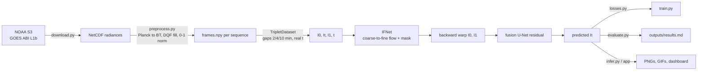

# SatFIN — Satellite Frame Interpolation Network

RIFE-style optical-flow frame interpolation to raise the temporal resolution of
geostationary satellite imagery. Trains on 1-min GOES mesoscale data, runs
inference on low-cadence data (10/30-min, incl. INSAT-3DS).



Pipeline: download → preprocess → train → evaluate → infer / dashboard.
Quick demo of the whole pipeline on the small sample (small download, 500 CPU steps):
`bash scripts/quick_demo.sh` or `powershell -File scripts/quick_demo.ps1`.
Set `STEPS=20 N=8` for a smoke test that takes about 2 minutes.

## Setup

Requires Python 3.10+.

```bash
python -m venv .venv
# Windows: .venv\Scripts\activate    Linux/macOS: source .venv/bin/activate
pip install -r requirements.txt       # CUDA: install torch from pytorch.org first
python -m satfin.env_check            # prints Python/PyTorch/GPU info
```

No GPU? Everything falls back to CPU with tiny settings.

## Data download

GOES ABI L1b radiances come from the public NOAA buckets (`noaa-goes16/18/19`, anonymous).
Mesoscale sectors (`M1`, `M2`) run at ~1-min cadence and give real ground truth.

```bash
python -m satfin.data.download --satellite goes19 --band 13 --start 2025-06-01T18:00 --hours 3 --sector M1
# or: bash scripts/download_goes.sh
```

Files land in `data/raw/<satellite>/<sector>/C<band>/`; existing files are skipped.
`--sector F|C` also works (full disk / CONUS, 10/5-min cadence). Defaults live in `configs/default.yaml`.
Mesoscale sectors can be moved between events, so check the sector center when picking dates.

## Preprocessing

```bash
python -m satfin.data.preprocess
```

Radiance becomes brightness temperature (BT) through each file's Planck constants. BT is normalized to [0,1] using fixed bounds (`bt_min`/`bt_max`, 180–330 K).
Pixels flagged bad by the DQF quality field (value 2 or higher) are NaN-filled with the frame mean.
Each contiguous run of frames goes to `data/processed/<name>/` as `frames.npy` (float16), `times.npy` and `meta.json`.

Training triplets `(I0, It, I1, t)` are built from the 1-min sequences with simulated gaps of 2, 4 and 10 frames.
`t` comes from the real scan timestamps. Augmentation uses random crops, flips, 90° rotations and time reversal.
The train/val/test split is **by date** (`data.splits` in the config), so no scene leaks across splits.

| split | date | sector | frames | triplets |
|---|---|---|---|---|
| train | 2025-06-01 18–21Z | M1, 32.5N 98.9W | 180 | 2236 |
| val | 2025-06-05 18–20Z | M1, 35.5N 101.0W | 120 | 1456 |
| test | 2025-06-10 18–20Z | M2, 32.6N 102.0W | 120 | 1456 |

```bash
python -m satfin.data.download --start 2025-06-05T18:00 --hours 2 --sector M1
python -m satfin.data.download --start 2025-06-10T18:00 --hours 2 --sector M2
```

## Training

```bash
python -m satfin.train                             # full run; CPU gets the `cpu` overrides from the config
python -m satfin.train --overfit 20 --steps 500    # sanity check: memorize 20 fixed triplets
python -m satfin.train --resume runs/<name>/last.pt
tensorboard --logdir runs
```

The loss is Charbonnier on the predicted frame, weighted up on cold cloud tops (< 235 K, ×5) and on fast-changing
pixels (|ΔBT| > 5 K across the gap, ×3). A small flow-smoothness term and an image-gradient term (for sharp edges) are added.
Validation logs PSNR for SatFIN and for linear blending, plus an `I0 | GT | pred | I1 | error` image grid.
The best-PSNR checkpoint goes to `best.pt`.
Classical baselines live in `satfin/baselines.py`: linear blending and OpenCV DIS/Farneback flow warping.

## Evaluation

```bash
python -m satfin.evaluate --ckpt runs/cpu-2k/best.pt --n 100  # -> outputs/results.md, results.json
```

PSNR, SSIM, MAE and cold-cloud MAE (ground-truth BT < 235 K) in kelvin, plus ms/frame, on the **test** date,
overall and per gap (2/4/10 min). `--n` is triplets per gap. The comparison is SatFIN vs linear blending vs
OpenCV DIS optical flow. `outputs/results.json` holds the same numbers for the dashboard.

## Inference

```bash
python -m satfin.infer --ckpt runs/cpu-2k/best.pt --seq data/processed/<name> --i0 0 --i1 10 --k 9
```

This inserts `k` frames at evenly spaced t between two frames and writes `outputs/interp_*.png`, `interpolated.gif` and `original.gif`.
When real 1-min frames exist for every t, it also writes `ground_truth.gif`.
The model takes any t in [0,1], so `interpolate(model, i0, i1, ts)` in `satfin/infer.py` accepts arbitrary times.

## Dashboard

```bash
streamlit run app/dashboard.py
```

Pick a checkpoint, a sequence and an upsampling factor. It shows the original, interpolated and ground-truth GIFs side by side,
clip metrics for all three methods (with SatFIN's delta vs linear), per-frame PSNR across the gap, and the test-set
evaluation from `outputs/results.json`: model stats, overall table, per-gap charts and tables.

## Results

> **Small-scale run.** 1.14 M-param model, CPU only, 128×128 crops, batch 4, **1500 training steps** (the planned 2000-step CPU run was stopped early), 3 h of training data from one day. These numbers show the pipeline works. They do not show what the method can reach.

Split `test`, 64 evenly spaced triplets (gaps [2, 4, 10] min), 128x128 center crop, checkpoint `runs/cpu-2k/best.pt`.

| method | PSNR (dB, higher=better) | SSIM (higher=better) | MAE (K, lower=better) |
|---|---|---|---|
| Linear blend | 37.11 | 0.9514 | 1.292 |
| OpenCV DIS flow | 42.42 | 0.9857 | 0.703 |
| SatFIN | 37.82 | 0.9572 | 1.184 |

After this short run, SatFIN beats linear blending but **not** classical DIS optical flow. It still needs the full GPU schedule (20k steps, 256 crops) and more training days.

## Limitations

- Trained and tested on one IR band (C13), three 2–3 h mesoscale windows over the southern US Great Plains in June 2025. It has not been tested on other regions or seasons.
- Results come from a short CPU run and are below the DIS-flow baseline.
- Nothing has been run on INSAT-3DS or other low-cadence imagery yet. There is no ground truth there, and the domain differs (resolution, sensor).
- Metrics use a 128×128 center crop of 64 test triplets, not full frames.

## Future work

- Full GPU training (`python -m satfin.train`) on more days and regions, then re-run `evaluate.py`.
- Full-frame metrics.
- INSAT-3DS loader and inference.
- Multispectral input (`model.channels`).
